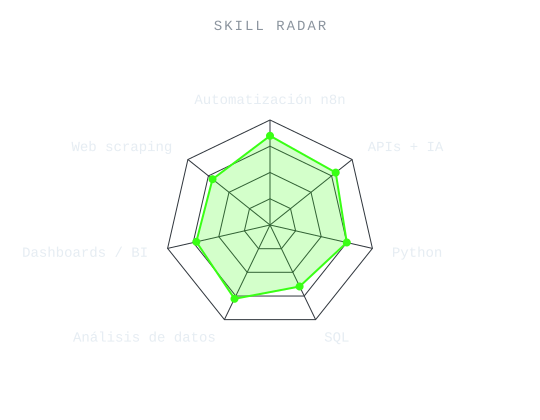
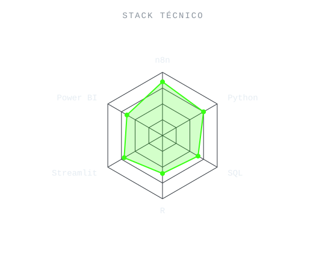
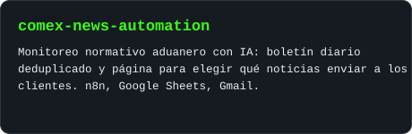
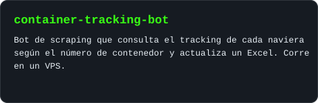
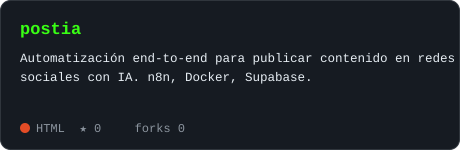
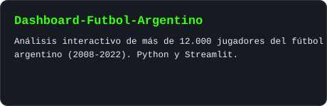
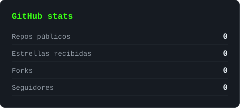
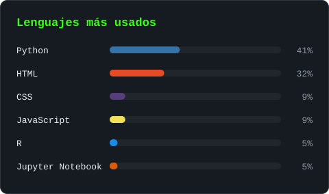

<!-- BANNER - terminal profile.sh --live. Generado por scripts/build_assets.py desde assets/profile.json -->
<picture>
  <source media="(prefers-color-scheme: dark)"  srcset="assets/banner-dark.svg">
  <source media="(prefers-color-scheme: light)" srcset="assets/banner-light.svg">
  
</picture>

 

<!-- NOMBRE / TAGLINE - tipeo animado -->

 

<!-- REDES -->
&nbsp;&nbsp;
&nbsp;&nbsp;
&nbsp;&nbsp;

 

---

## Este soy yo :)

Hola, soy **Nicolás**, desarrollador de automatizaciones con IA y estudiante de ciencia de datos, desde Buenos Aires 🇦🇷.
Me dedico a que los procesos repetitivos se hagan solos, y me gusta que la gente pueda usar esa tecnología sin tener que entenderla.

-  **Automatización con IA:** workflows en n8n que detectan, extraen, procesan y envían información sin que nadie los toque. Hoy corren para empresas reales.
-  **Último proyecto:** monitoreo normativo aduanero para una empresa de comercio exterior, más un bot de tracking de contenedores que corre en la nube.
-  **Desafío Beltrán 2026:** segundo puesto entre todos los equipos de tercer año con *Sin Luz*, un sistema comunitario ante cortes de energía. Mi aporte fue la automatización de reportes semanales.
-  Estudio **Ciencia de Datos e Inteligencia Artificial** en el Instituto Tecnológico Beltrán y armo dashboards con Python, R y Power BI.
-  Freelance en **Fiverr** y **Workana**.
-  Busco mi primera experiencia como **Automation Developer**, **Analista de Datos** o **Data Trainee**.
-  Hablame de automatización, IA aplicada a procesos y de cómo devolverle tiempo a un equipo.

 

## mi stack

  

---

## signals

<table>
<tr>
<td width="50%" align="center" valign="middle">

<!-- Radar autoevaluado - editá assets/skills.json y el workflow lo redibuja -->
<picture>
  <source media="(prefers-color-scheme: dark)"  srcset="assets/radar-dark.svg">
  <source media="(prefers-color-scheme: light)" srcset="assets/radar-light.svg">
  
</picture>

</td>
<td width="50%" align="center" valign="middle">

<!-- Radar de stack - editá assets/stack.json -->
<picture>
  <source media="(prefers-color-scheme: dark)"  srcset="assets/radar-stack-dark.svg">
  <source media="(prefers-color-scheme: light)" srcset="assets/radar-stack-light.svg">
  
</picture>

</td>
</tr>
</table>

---

## proyectos destacados

<!-- Tarjetas generadas por scripts/build_assets.py desde assets/projects.json -->
<table>
<tr>
<td align="center">
<a href="https://github.com/Nicolas-Mesquiatti/comex-news-automation">
<picture>
  <source media="(prefers-color-scheme: dark)"  srcset="assets/card-comex-news-automation-dark.svg">
  <source media="(prefers-color-scheme: light)" srcset="assets/card-comex-news-automation-light.svg">
  
</picture>
</a>
</td>
<td align="center">
<a href="https://github.com/Nicolas-Mesquiatti/container-tracking-bot">
<picture>
  <source media="(prefers-color-scheme: dark)"  srcset="assets/card-container-tracking-bot-dark.svg">
  <source media="(prefers-color-scheme: light)" srcset="assets/card-container-tracking-bot-light.svg">
  
</picture>
</a>
</td>
</tr>
<tr>
<td align="center">
<a href="https://github.com/Nicolas-Mesquiatti/postia">
<picture>
  <source media="(prefers-color-scheme: dark)"  srcset="assets/card-postia-dark.svg">
  <source media="(prefers-color-scheme: light)" srcset="assets/card-postia-light.svg">
  
</picture>
</a>
</td>
<td align="center">
<a href="https://github.com/Nicolas-Mesquiatti/Dashboard-Futbol-Argentino">
<picture>
  <source media="(prefers-color-scheme: dark)"  srcset="assets/card-Dashboard-Futbol-Argentino-dark.svg">
  <source media="(prefers-color-scheme: light)" srcset="assets/card-Dashboard-Futbol-Argentino-light.svg">
  
</picture>
</a>
</td>
</tr>
</table>

---

## ¿los números importan? obvio.

<picture>
  <source media="(prefers-color-scheme: dark)"  srcset="assets/card-stats-dark.svg">
  <source media="(prefers-color-scheme: light)" srcset="assets/card-stats-light.svg">
  
</picture>

 

<picture>
  <source media="(prefers-color-scheme: dark)"  srcset="assets/card-langs-dark.svg">
  <source media="(prefers-color-scheme: light)" srcset="assets/card-langs-light.svg">
  
</picture>

---

` Hecho con ❤️ desde Buenos Aires · n8n + Python `

